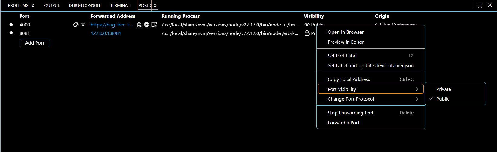

# 🛠️ Authentication Setup Guide

This project was extended with a **basic login system** using **MongoDB**, **Express**, and **JWT**.  
Follow these steps if you’re setting up the project for the first time.

---

## 📂 Directory Structure (New/Updated Files)

```
WanderOn-main/
├── app/
│   └── (tabs)/
│       └── login.tsx      # New login page with email/password form
├── lib/
│   └── api.ts            # New API helper for frontend requests + token storage
├── server/
│   ├── .env              # New env file with MONGO_URI, PORT, JWT_SECRET
│   ├── package.json      # Updated with backend dependencies
│   └── src/
│       ├── index.ts      # New Express server entry (handles CORS, routes)
│       ├── auth.ts       # New auth routes (login + /me)
│       └── models/
│           └── User.ts   # New Mongoose User model (collection: users)
```

---

## ⚙️ Environment Variables

Create `server/.env`:

```ini
MONGO_URI=mongodb+srv://<USERNAME>:<PASSWORD>@wanderon-project.zjs7tjq.mongodb.net/users_db?retryWrites=true&w=majority&appName=WanderOn-Project
PORT=4000
JWT_SECRET=dev-secret
```

---

## 🚀 Running the App

1. **Backend:**
   ```bash
   cd server
   npm run dev
   ```
   - Ensure port `4000` is **Public** in Codespaces (Ports panel).
   - Test at: `https://<your-4000-url>.app.github.dev/ping` → should return `{"ok":true}`.
   - Making it public->
     

2. **Frontend:**
   ```bash
   yarn start --web
   ```
   - Visit the URL Expo prints (usually `http://127.0.0.1:8081`).
   - Open **Login** tab, sign in with your seeded user.

---

## 🧪Current Users & Passwords same as Username
1. srm6735
2. max
3. khanh
4. swastik

